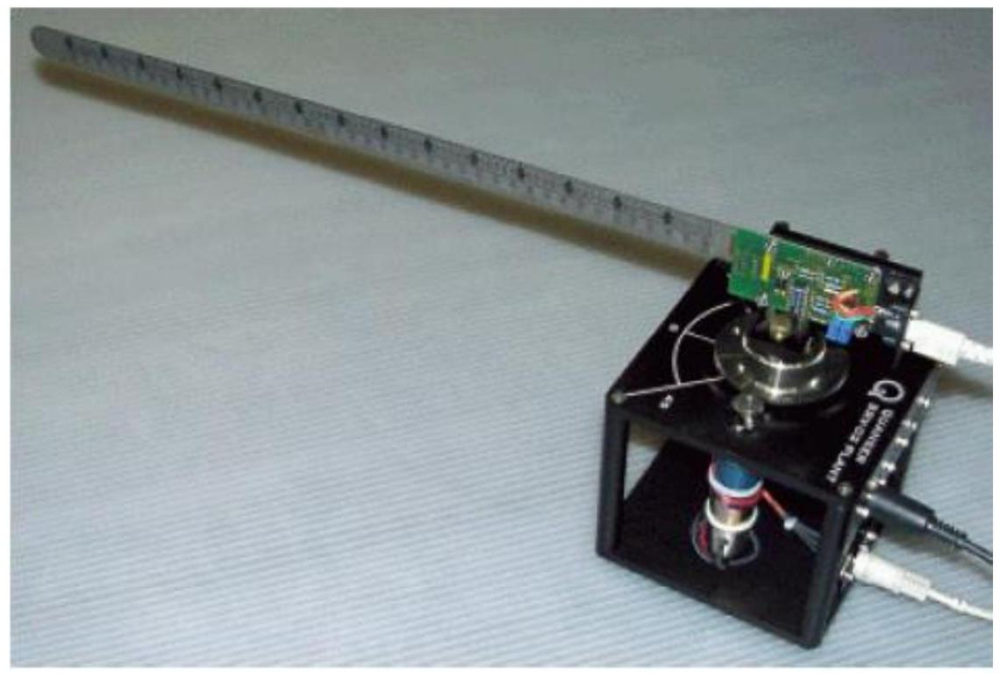
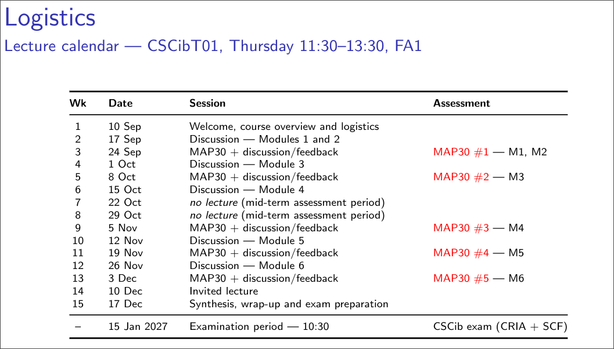
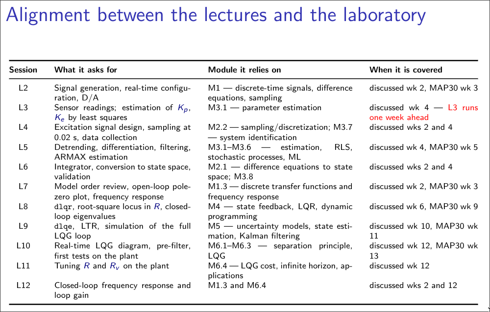

# CSCib - Control of Cyber-physical Systems

## About the course

This is the IST course on Control of Cyber-physical Systems (CSCib).
It covers how to model, identify, and control real physical systems from a computer, connecting classical control theory to actual hardware.
Topics include system identification, sampling and digital interfacing, and modern controller design methods such as LQG/LTR.

## About the lab

The laboratory work uses a Quanser flexible robot arm joint (the plant shown above), a DC motor driving a flexible bar.
It is split into two parts.
Part I is about identifying a model of the plant from experimental data, covering excitation signals, sampling frequency, filtering, and model validation.
Part II is about designing and testing a controller for the identified model, using an LQG/LTR approach with a pre-filter, and evaluating the closed-loop performance.
The full report is written in `report/report.tex`.

## Links and deadlines

- Report deadline: 23:59, 7 December (session L12, week 14)
- Class tutor (ccpsGPT): https://tinyurl.com/ccpsGPT
- Link to L1 summary: https://tinyurl.com/29dpkmwz

## Logistics

The lecture calendar below sets the weekly sessions, the MAP30 assessment dates, and the exam date.

The lab sessions rely on specific lecture modules, so it is important to keep the two schedules aligned.

